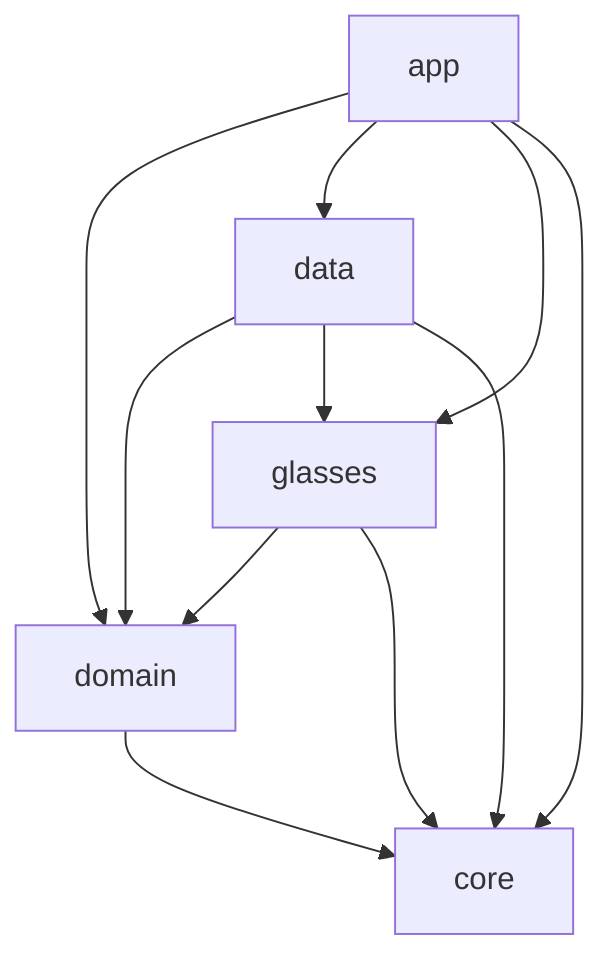
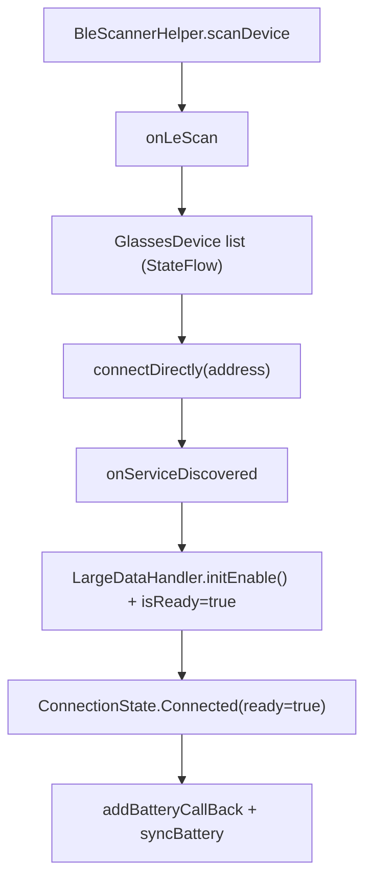

# Architecture

Beacon follows Clean Architecture + MVVM with a small multi-module Gradle setup.

## Modules

| Module      | Responsibility |
|-------------|----------------|
| `:app`      | `MainActivity`, Compose screens, ViewModels, navigation, DI entry, theme |
| `:domain`   | Business models, `GlassesRepository` interface, use cases (pure logic) |
| `:data`     | Repository implementations, DataStore preferences, Hilt bindings |
| `:glasses`  | Vendor SDK wrapper: `GlassesManager` abstraction, `HeyCyanGlassesManager`, `FakeGlassesManager`, SDK init/receiver |
| `:core`     | Cross-cutting utilities: dispatchers, result wrapper, logging, permissions, Bluetooth state, haptics |

Dependencies point inward: `app -> data/domain/glasses/core`,
`data -> domain/glasses/core`, `glasses -> domain/core`, `domain -> core`.

## Vendor isolation

The rest of the app never references `com.oudmon.*` directly. All vendor calls
go through the `GlassesManager` interface in `:glasses`, which is selected by
Hilt - either `HeyCyanGlassesManager` (real hardware) or `FakeGlassesManager`
(emulator/tests), switched by the `USE_FAKE_GLASSES` build config flag.

## Async & threading

- Coroutines + Flow everywhere; `StateFlow` for connection/battery state.
- All BLE/Wi-Fi calls run off the main thread via `DispatcherProvider.io`.
- Long-running active guidance (later phases) uses a foreground service.

## Connection state flow (Phase 1)

